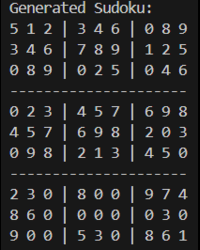
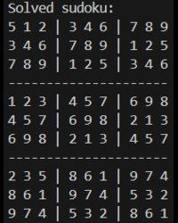
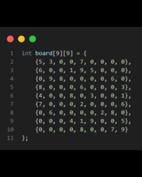
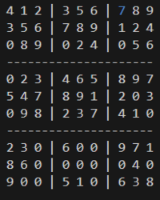
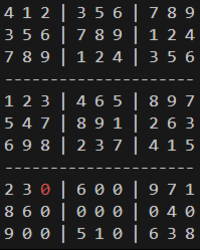

# sudoku-solver-in-cpp

A simple Sudoku solver implemented in C++. This project generates a random Sudoku puzzle or allows you to create your own puzzle by editing the code. The solver computes the solution using a recursive backtracking algorithm.

## Features

- Solves standard 9x9 Sudoku puzzles
- Generates a random Sudoku puzzle on each run
- Option to create your own puzzle by modifying the source code
- Visualize the backtracking algorithm in action using colors and a timeline (see the `solveSudoku` function with color and timeline parameters)
- Simple and clean C++ codebase, easy to understand and modify
- Console output of solved puzzles

## Installation

1. **Clone the repository:**
   ```sh
   git clone https://github.com/TheSebitzu/sudoku-solver-in-cpp.git
   cd sudoku-solver-in-cpp
   ```

2. **Build the project:**
   - Using g++:
     ```sh
     g++ -o sudoku_solver main.cpp
     ```
   - Or use your favorite C++ IDE.

## Usage

- By default, the program generates a random Sudoku puzzle and attempts to solve it.
- If you want to solve a specific puzzle, modify the `board` array in the source code (located in the `main` function).
- Run the solver:
  ```sh
  ./sudoku_solver
  ```
- The generated puzzle and its solution (or a message if unsolvable) will be printed to the console.
- **Visualization:**  
  You can watch the backtracking algorithm "run" step by step, with different colors representing the solver's progress and a timeline of updates. This is managed through the `solveSudoku` function, which accepts color and timeline parameters.
  - ⚠️ **Warning:** Enabling the timeline option can make the solving process take a very long time, especially for difficult puzzles.

## How It Works

- The program generates a 9x9 grid representing a Sudoku puzzle, where empty cells are denoted by `0`.
- It uses a recursive backtracking algorithm to fill in the missing numbers while following Sudoku rules.
- If a solution is found, it's printed; otherwise, it notifies the puzzle is unsolvable.
- The solving process can be visualized, showing algorithm steps using color and timeline updates.

## Screenshots

| Generated Puzzle | Solved Output | Puzzle Array Code | Timeline (Good Move) | Timeline (Bad Move) |
|------------------|--------------|------------------|-----------------------------|---------------------------|
|  |  |  |  |  |

## Limitations

- **Only solves standard 9x9 Sudoku puzzles.**  
  Other grid sizes or variants are not supported.
- **Requires puzzle to be set in code.**  
  To solve a specific puzzle, you must modify the puzzle array in the source code.
- **No graphical interface.**  
  All input and output are via the console.
- **Does not check for multiple solutions.**  
  The solver finds one valid solution (if any), but does not inform if multiple solutions exist.

## Requirements

- C++11 or newer compiler (e.g., g++, clang++)
- Make or similar build tool (optional)

## License

This project is licensed under the MIT License.

---

*Made by [TheSebitzu](https://github.com/TheSebitzu)*